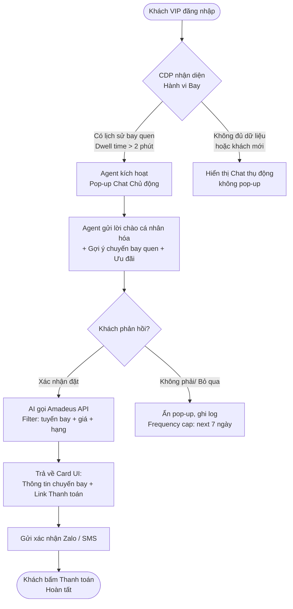
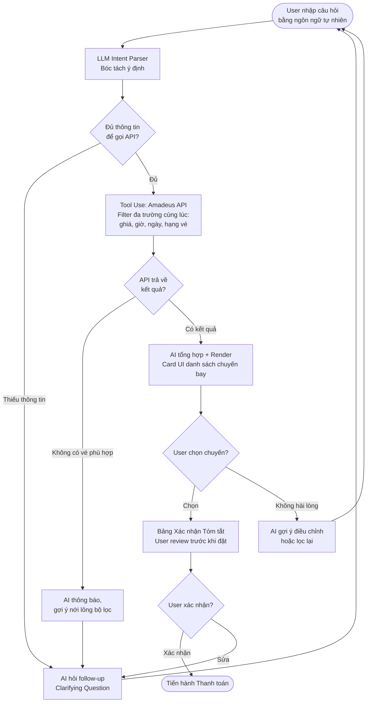
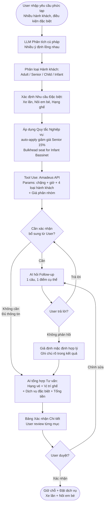
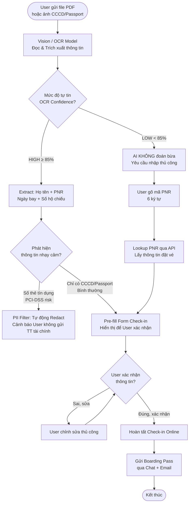
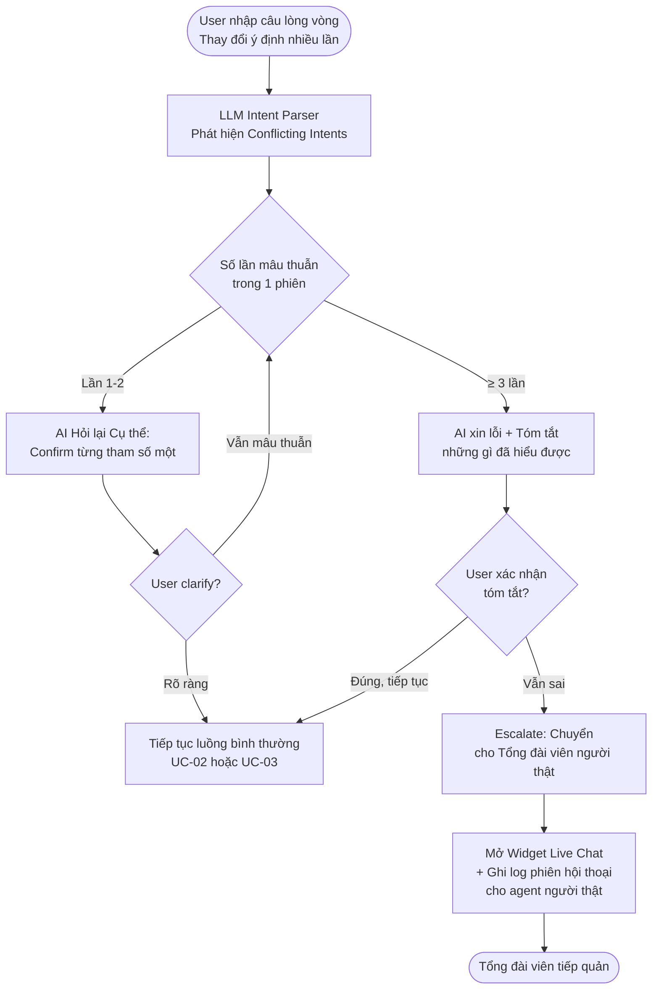

# Vietnam Airlines – Omni-channel Proactive LLM Agent
## Implementation Plan (Prototype v0.1)

Dựa trên bản phân tích AI Product Canvas, hệ thống cần phải giải quyết 2 điểm nghẽn chính:
1. Bộ lọc vé thủ công chỉ lọc được 1 trường tại 1 thời điểm
2. Thiếu chăm sóc chủ động, cá nhân hóa với khách hàng thân thiết

---

## User Review Required

> [!IMPORTANT]
> Đây là **bản phân tích + diagram** để confirm hiểu đúng yêu cầu, **CHƯA phải code prototype**. Vui lòng review và approve trước khi tiến hành build.

> [!WARNING]
> Prototype sẽ là **frontend-only demo** (không có backend thật). API calls tới Amadeus, CDP, Zalo sẽ được **mock** bằng dữ liệu giả để demo flow. Nếu cần tích hợp thật, cần thảo luận thêm.

---

## Các Tính năng & Use Case Cơ bản

Từ BMC, xác định được **4 use case cốt lõi**:

| # | Use Case | Actor | Mô tả ngắn |
|---|----------|-------|------------|
| UC-01 | Cá nhân hóa Chủ động (Proactive Greeting) | Khách VIP đã đăng nhập | Agent nhận diện thói quen bay, chủ động gợi ý chuyến bay thân quen + ưu đãi phù hợp |
| UC-02 | Tìm vé Lọc Đa trường (Multi-field Search) | Bất kỳ người dùng | Chat bằng ngôn ngữ tự nhiên và AI tự phân tách, gọi API với nhiều tham số cùng lúc |
| UC-03 | Suy luận Đa bước cho Nhóm phức tạp | Gia đình, người cao tuổi, trẻ em | AI hỏi follow-up, phân loại hành khách, tư vấn hạng ghế, dịch vụ đặc biệt + tính tổng |
| UC-04 | Check-in bằng File PDF / Ảnh CCCD | Bất kỳ người dùng | Upload ảnh/PDF, AI Extract thông tin, điền form check-in tự động |

Ngoài ra còn **2 failure path** quan trọng cần handle:

| # | Failure Path | Mô tả |
|---|------|-------|
| FP-01 | Truy vấn lòng vòng / Ảo giác | User thay đổi ý định liên tục → AI bị rối → Hỏi lại hoặc transfer to agent |
| FP-02 | PDF mờ / Low confidence OCR | AI không đọc được → Hỏi PNR thủ công → Hoàn tất qua mã |

---

## Flow Diagrams (Mermaid)

### UC-01: Proactive Greeting – Cá nhân hóa Chủ động



---

### UC-02: Multi-field Natural Language Search – Lọc Đa trường



---

### UC-03: Multistep Reasoning – Đặt vé Nhóm Phức tạp



---

### UC-04: Multimodal Check-in – Check-in bằng PDF/Ảnh



---

### FP-01: Failure Path – Truy vấn Lòng vòng



---

## Proposed Prototype Scope (v0.1)

Dựa trên phân tích, prototype sẽ là một **Web App giao diện chat** demo đủ 4 use case:

### Giao diện bao gồm:
1. **Landing Page** – Hero section với branding Vietnam Airlines
2. **Chat Widget** – Giao diện chat nổi, hỗ trợ bubble messages, typing indicator, streaming text
3. **Card UI** – Component hiển thị kết quả chuyến bay (Flight Card)
4. **Proactive Pop-up** – Modal tự bật sau 2s với greeting cá nhân hóa (có thể toggle)
5. **File Upload** – Khu vực kéo thả file PDF/ảnh cho UC-04
6. **Confirmation Panel** – Bảng xác nhận trước khi "đặt"

### Tech Stack:
- **HTML + CSS + Vanilla JS** (không cần backend, dùng mock data)
- Mock LLM responses: State machine đơn giản nhận diện keyword và route đúng flow
- Mock Amadeus API: Dữ liệu chuyến bay hardcoded JSON

### Files dự kiến:
```
Nhom72-403-Day05/
├── index.html           # Landing page + Chat widget
├── css/
│   ├── main.css         # Design system, tokens
│   ├── chat.css         # Chat component styles
│   └── cards.css        # Flight card styles
├── js/
│   ├── chatbot.js       # State machine + Message routing
│   ├── mock-api.js      # Mock Amadeus + CDP data
│   ├── flows/
│   │   ├── uc01-proactive.js   # UC-01 flow
│   │   ├── uc02-search.js      # UC-02 flow  
│   │   ├── uc03-group.js       # UC-03 flow
│   │   └── uc04-checkin.js     # UC-04 flow
│   └── ui.js            # UI helpers, card renderer
└── assets/
    └── (images, icons)
```

---

## Verification Plan

### Kiểm tra thủ công theo từng Use Case:
- [ ] UC-01: Đăng nhập như User VIP → Pop-up hiện đúng → Chat → Nhận Card chuyến bay → "Đặt"
- [ ] UC-02: Nhập câu dài có nhiều điều kiện → AI parse đúng → Hiện danh sách chuyến → Confirm
- [ ] UC-03: Nhập yêu cầu gia đình 4 người → AI phân loại → Tư vấn đúng hạng/dịch vụ → Tổng tiền
- [ ] UC-04: Upload PDF → Hiện thông tin extract → Confirm → Boarding pass
- [ ] FP-01: Nhập câu lòng vòng → AI hỏi lại → Nếu quá 3 lần → Nút "Gặp nhân viên"

### Open Questions:
> [!IMPORTANT]
> 1. Prototype có cần hỗ trợ **Mobile responsive** không hay chỉ cần chạy trên Desktop?
> 2. Có muốn thêm **Dark Mode** cho giao diện chat không?
> 3. Ngôn ngữ giao diện: **Tiếng Việt hoàn toàn** hay cần cả tiếng Anh?
